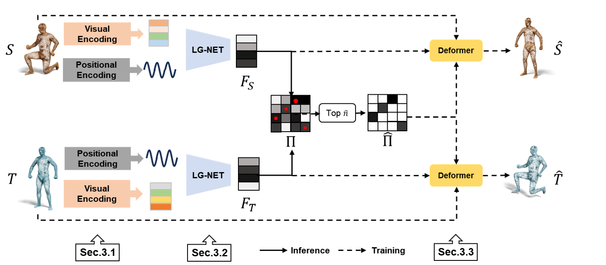

# DV-Matcher: Deformation-based Non-rigid Point Cloud Matching Guided by Pre-trained Visual Features
[](https://arxiv.org/pdf/2408.08568)
[](https://drive.google.com/drive/folders/1CK9qihI2yyxkuXsxSHqzTRhLdTk8qghn?usp=sharing)
[](https://openaccess.thecvf.com/content/CVPR2025/html/Chen_DV-Matcher_Deformation-based_Non-rigid_Point_Cloud_Matching_Guided_by_Pre-trained_Visual_CVPR_2025_paper.html)

## Instruction
A novel learning-based framework for estimating dense correspondences between non-rigidly deformable point clouds.
1. We propose a scheme to inject prior knowledge from pre-trained vision models into geometric feature learning, which effectively complements the local nature of geometric features with global and semantic information.
2. We propose a novel deformation-based module to promote the extrinsic alignment induced by the learned correspondences, which effectively enhances the feature learning. 

## Method overview


## Data
The dataset is now available at [here](https://drive.google.com/drive/folders/1CK9qihI2yyxkuXsxSHqzTRhLdTk8qghn?usp=sharing)

## Quick Start
### Clone the repository
```shell
git clone https://github.com/rqhuang88/DV-Matcher.git
```

### Installation
We tested the code on python `3.10.13`; torch version `2.2.0`.
```shell
cd DV-Matcher
pip install requirements.txt
pip install git+https://github.com/mhamilton723/FeatUp
```
* Remark: For pointnet2, you could clone from `https://github.com/erikwijmans/Pointnet2_PyTorch`. Then use `python setup.py` install to build it.
* Remark: For psbody-mesh, you could built by `pip install git+https://github.com/MPI-IS/mesh.git`.

### Training
We have provided two examples which can be simply executed, corresponding to the full and partial training of SCAPE dataset, respectively.
```shell
# the traing of scape_r (full)
python train.py
# the training of scape_partial (partial)
python train_partial.py
```
If you want to get the deformed results using our deformer after training, you can:
```shell
python deform.py
```
* Remark: You can change the dataset, as well as other parameters by modifying the config file.

### Testing
You can test the model using the following scripts:
```shell
# test full cases
python test_full.py
# test partial cases
python test_partial.py
``` 

### Evaluation
You can evaluate the results [different benchmarks] reported in Table of our paper via scripts under `eval/main.m`.
Besides, use `eval/geo_mat.py` to calculate the geodesic distance mat ahead. 

### More scripts
In `misc/scripts`, we have provided more scripts about how we get the partial shapes from 12 different views. Besides, we also exhibt how we add noise/rotation to the dataset for robustness evaluation.

## Key Files
1. `ckpt/` includes our trained checkpoints, both the weight of LG-Net and the weight of deformer. After training, your checkpoints would be saved here, too. Note the issues of file overwriting.
2. `config/` includes some hyperparameter configuration, as well as the files path. You can choose the config file to load while training/testing.
3. `data/` includes all the dataset you'd use to train/test.
4. `models/` includes the main source codes, including our model architecture, loss function, as well as how the dataset is organized.
5. After training/tesing, feel free to check the results in `result/`, and training curves under `tensorboard/`. During training, the registration result of deformer would keep changing under `visual_result/`.

## Acknowledgements
This code utilizes the following Pytorch 3rd-party libraries:
* [FeatUp](https://github.com/mhamilton723/FeatUp)
* [ChamferDistancePytorch](https://github.com/ThibaultGROUEIX/ChamferDistancePytorch)
* [emd](https://github.com/paul007pl/VRCNet)
* [PointNet](https://github.com/sshaoshuai/Pointnet2.PyTorch)
* [psbody](https://github.com/MPI-IS/mesh)

## Bibtex
If you find DV-Matcher helpful for your work, please cite

```
@inproceedings{chen2025dv,
  title={DV-Matcher: Deformation-based Non-rigid Point Cloud Matching Guided by Pre-trained Visual Features},
  author={Chen, Zhangquan and Jiang, Puhua and Huang, Ruqi},
  booktitle={Proceedings of the Computer Vision and Pattern Recognition Conference},
  pages={27264--27274},
  year={2025}
}
```
